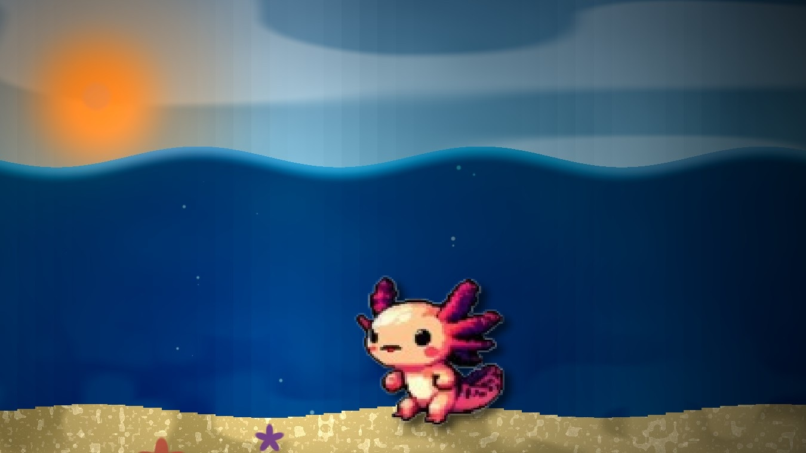

# Axolotl Animation with GLSL Shaders

An interactive web-based animation featuring an axolotl character that transitions between underwater and land environments using GLSL shaders. The animation showcases a seamless sprite animation system coupled with real-time GLSL shader effects.

## Features

- **Sprite Animation System**: Features a 12-frame animation cycle for various actions
  - Get Up
  - Run
  - Sprint
  - Water-to-Land Transition
  - Land Movement
  
- **GLSL Shader Effects**:
  - Underwater shader with caustics, bubbles, and dynamic lighting
  - Land shader with sun rays, atmospheric effects, and natural transitions
  - Smooth transition between underwater and land environments

- **Interactive Controls**:
  - Real-time adjustable shader parameters
  - Customizable sprite size and movement speed
  - Detailed animation statistics and debugging information

## Implementation Details

- **Animation Framework**: 
  - Custom-built sprite animation system with double-framing for smoother transitions (12 FPS with double display to simulate 24 FPS)
  - 20-second animation cycle with coordinated environment transitions
  - Sprite sheet organization with 10x10 grid of 64x64 pixel frames, with pairs of rows for each animation

- **Shader System**:
  - WebGL implementation for hardware-accelerated rendering
  - Multiple canvas layers with proper z-indexing
  - Real-time shader parameter adjustment

## Usage

1. Clone the repository
2. Install dependencies: `npm install`
3. Start the development server: `npm start`
4. Open your browser to the local development URL (typically http://localhost:8080)

## Controls

The application features an interactive control panel with:

- **Animation Control**:
  - Start/Reset button to begin the animation sequence
  - Toggle for debug information visibility

- **Shader Controls**:
  - Sun Ray Intensity: Adjust the brightness and glow of the sun
  - Wave Frequency: Control the speed and intensity of water movement

- **Sprite Controls**:
  - Sprint Speed: Adjust how fast the character moves during sprint animations
  - Sprite Size: Scale the axolotl character larger or smaller

- **Debug Information**:
  - Current animation state and sequence progress
  - Frame information including row pairs and double framing
  - Position and movement tracking
  - Water transition status

## Technical Notes

- Built with vanilla JavaScript and WebGL
- No external animation libraries used
- Custom GLSL shaders for all visual effects
- Responsive design with adjustable canvas size

## License

MIT License - Feel free to use and modify for your own projects.

## Acknowledgments

- Sprite artwork created with care for the beloved axolotl character
- Shader effects inspired by natural underwater caustics and lighting 